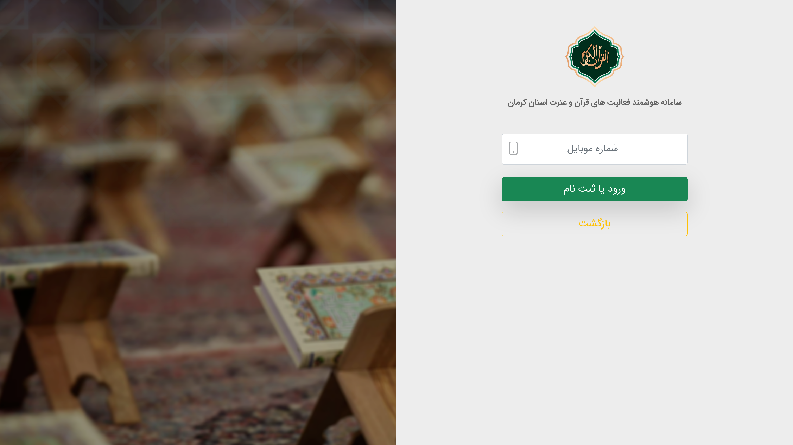
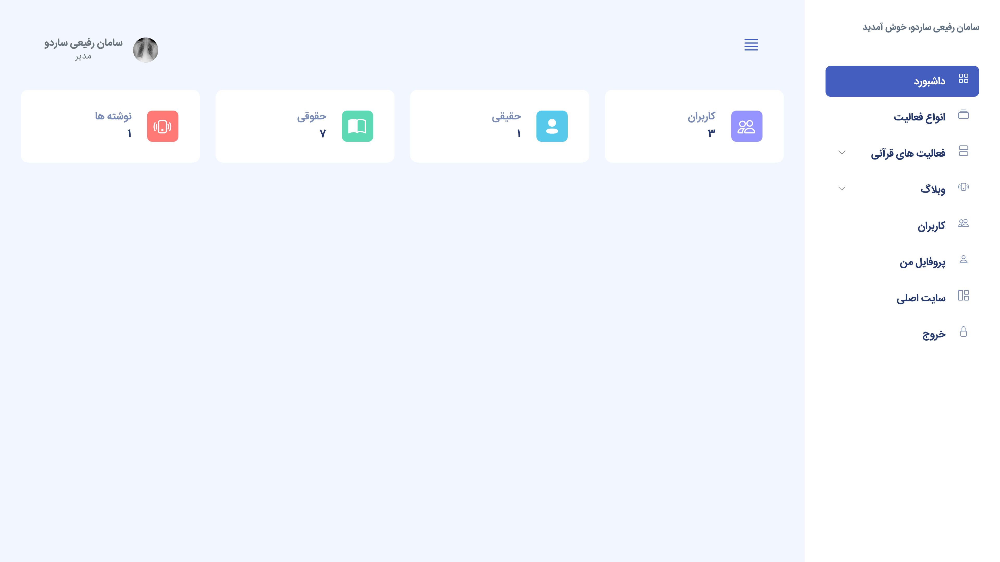
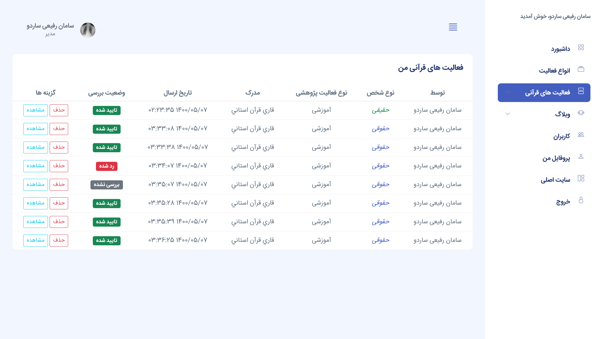

<h1>Quranic activities management system of Shahid Bahonar University of Kerman</h1>

This web-based project was developed with the Django framework. 
This project has been developed at the request of the cultural deputy of Shahid Bahonar University of Kerman. Its goal is to create an automation system to manage Quranic activities in Kerman province.

<h3>Use this information to log in:</h3>

Admin Number: 09211111111

OTP Code: 1234

